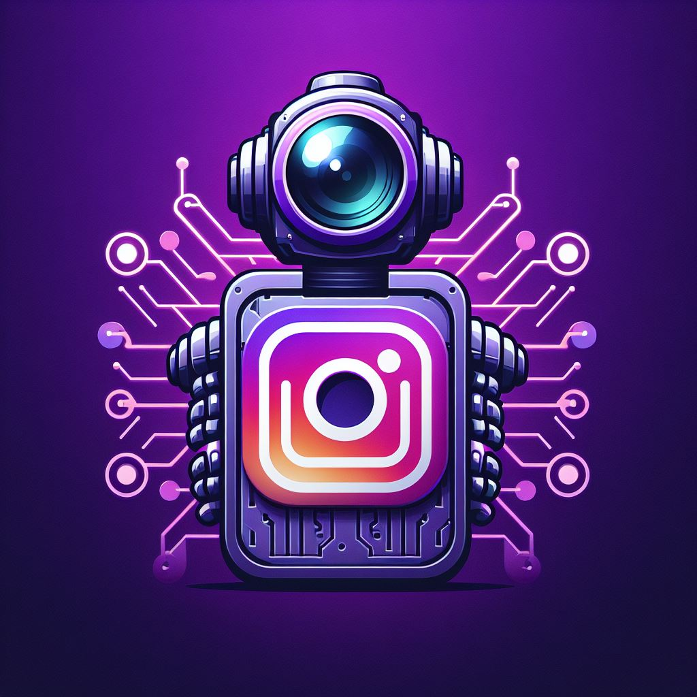

# My Insta Assistant

**My Insta Assistant** is a super-power GitHub repository designed to revolutionise your Instagram engagement. With its advanced scraping capabilities, **My Insta Assistant** scours through your favourite Instagram accounts and YouTube channels the latest reels and shorts for your Instagram feed. Stay effortlessly connected with the freshest content from your preferred creators while amplifying your Instagram presence❕

## Table of Contents

- Getting Started:
    - [Prerequisites](#prerequisites)
    - [Installation](#installation)
    - [Initial Configuration](#initial-configuration)
    - [Generate a YouTube API Key](#generate-a-youtube-api-key)
    - [Dashboard](#dashboard)
- [Contributing](#contributing)
- [License](#license)
- [Additional Features](#additional-features)
- [Frequently Asked Questions](#frequently-asked-questions)
- [Troubleshooting](#troubleshooting)

### Prerequisites

- Python 3.x
- A valid Instagram account
- A Google Developers Console project with the YouTube Data API enabled and an API key

### Installation

1. Clone the repository:

```bash
git clone https://github.com/eccentriccoder01/Automated-Insta-Reel-Collector-And-Poster
cd Automated-Insta-Reel-Collector-And-Poster
```

2. Install the required dependencies:

```bash
pip install -r requirements.txt
```

### Initial Configuration

Navigate to `src` directory:

```bash
cd src
```

To set up your initial configuration:

1. Run `start.py`:
```bash
python start.py
```

2. Follow the prompts to set up your Instagram credentials, YouTube API key, and other configuration settings... You may also choose to set the configuration variables manually in `src/config.py`

### Generate a YouTube API Key

1. Set up a Google Developers Console project and enable the YouTube Data API:

   a. Go to the [Google Developers Console](https://console.developers.google.com/).
   
   b. Create a new project by clicking the project drop-down menu, then click "New Project" and fill in the required fields, or select an existing project from the list.
   
   c. In the Dashboard, click on "Enable APIs and Services" and search for the "YouTube Data API v3". Click on it and then click the "Enable" button.
   
   d. Create an API key by going to "Credentials" in the left-hand menu, then click on "Create credentials" > "API key".

2. During the initial configuration process, you'll be prompted to input your YouTube API key. Enter the key when prompted.

Depending on the selected configuration options, this will scrape reels and shorts, store them in the `downloads` folder, and post them to your Instagram account at the specified interval.

### Dashboard

To see real-time updates, open a new terminal and run:

```bash
python dashboard.py
```

## Contributing

- Firstly Star(⭐) the Repository
- Fork the Repository and create a new branch for any updates/changes/issue you are working on.
- Start Coding and do changes.
- Commit your changes
- Create a Pull Request which will be reviewed and suggestions would be added to improve it.
- Add Screenshots and updated website links to help us understand what changes is all about.

- Check the [CONTRIBUTING.md](CONTRIBUTING.md) for detailed steps...

Enhance **My Insta Assistant** with your contributions! Whether you have innovative suggestions, spot bugs, or wish to introduce new features.
Contributions of any kind from anyone are always welcome🌟❕

## Additional Features

1. Reels and shorts scheduling: Schedule specific reels and shorts to be posted at certain times or dates.
2. Custom captions: Add custom captions to each reel or short when posting...
3. Multiple Instagram accounts: Support for posting reels and shorts to multiple Instagram accounts.
4. Analytics and Insights: Collect data on the performance of your posted reels and shorts...

## Frequently Asked Questions

#### Q: Can I run **My Insta Assistant** on a Raspberry Pi or similar devices?

A: Yes, **My Insta Assistant** can be run on a Raspberry Pi or any other device that supports Python 3.x and the required dependencies. However, you may need to adjust the configuration and installation steps to match the specific requirements of your device.

#### Q: Can I use **My Insta Assistant** for commercial purposes?

A: **My Insta Assistant** is released under the GNU General Public License v3.0, which allows you to use, modify, and distribute the software for both personal and commercial purposes. However, you must comply with the terms of the license, which includes providing the source code for any modifications you make and preserving the original copyright notices.

#### Q: Is it safe to use my Instagram account credentials with **My Insta Assistant**?

A: **My Insta Assistant** stores your Instagram account credentials in the `config.py` file, and they are used only for authenticating and posting reels andshorts to your account. However, make sure to keep your credentials secure and not share them with unauthorized parties. It is also recommended to use a secondary Instagram account for testing purposes before using your main account.

#### Q: Can I post reels and shorts from private Instagram accounts or YouTube channels?

A: **My Insta Assistant** can only scrape reels from public Instagram accounts and shorts from public YouTube channels. If you want to post content from private accounts or channels, you will need to obtain the necessary permissions and access to the content.

#### Q: Can I get banned from Instagram for using **My Insta Assistant**?

A: **My Insta Assistant** automates the process of posting reels and shorts to your Instagram account. While automation can potentially violate Instagram's terms of service, **My Insta Assistant** is designed to minimize the risk of getting banned by posting at regular intervals and not spamming your account. However, it is still recommended to use **My Insta Assistant** responsibly and at your own risk.

## Troubleshooting

1. **Issue**: **My Insta Assistant** is not scraping reels or shorts correctly.

   **Solution**: Ensure that the Instagram account usernames and YouTube channel links in `config.py` are correct and publicly accessible. Also, make sure that your YouTube API key is valid and has not exceeded the quota limits.

2. **Issue**: **My Insta Assistant** is not posting reels and shorts to my Instagram account.

   **Solution**: Verify that your Instagram account credentials in `config.py` are correct and that your account has not been banned or restricted. Additionally, check the `POSTING_INTERVAL_IN_MIN` and `SCRAPER_INTERVAL_IN_MIN` settings to ensure they are set to appropriate values.

3. **Issue**: I am receiving an error when running **My Insta Assistant** with Docker.

   **Solution**: Make sure you have properly installed and configured Docker on your system. Double-check the Docker build and run commands to ensure they are executed correctly. If the issue persists, consider running **My Insta Assistant** without Docker.

If you continue to face issues or need further assistance, please open an issue on the GitHub repository or reach out to the community for support.
